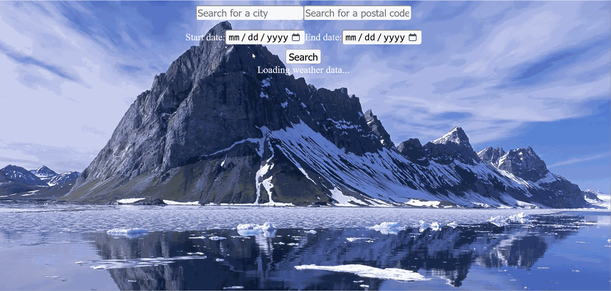

# Web Development Project 5 - *Weather App*

Submitted by: **Daniel Lin**

This web app: **Find out the weather in your area or in a past location!**

Time spent: **3** hours spent in total

## Required Features

The following **required** functionality is completed:

- [X] **The list displays a list of data fetched using an API call**
- [X] **Data uses the useEffect React hook and async/await syntax**
- [X] **The app dashboard includes at least three summary statistics about the data such as**
  - [X] *Provides the user the date, the max temperature of the day and the minimum temperature of the day*
- [X] **A search bar allows the user to search for an item in the fetched data**
- [X] **Multiple different filters (2+) allow the user to filter items in the database by specified categories**

The following **optional** features are implemented:

- [X] Multiple filters can be applied simultaneously
- [X] Filters use different input types such as a text input, a selection, or a slider
- [X] The user can enter specific bounds for filter values

The following **additional** features are implemented:

* [ ] List anything else that you added to improve the site's functionality!

## Video Walkthrough

Here's a walkthrough of implemented user stories:

<!-- Replace this with whatever GIF tool you used! -->
GIF created with LiceCap  
<!-- Recommended tools:
[Kap](https://getkap.co/) for macOS
[ScreenToGif](https://www.screentogif.com/) for Windows
[peek](https://github.com/phw/peek) for Linux. -->

## Notes

Describe any challenges encountered while building the app.
None.

## License

    Copyright [2023] [Daniel Lin]

    Licensed under the Apache License, Version 2.0 (the "License");
    you may not use this file except in compliance with the License.
    You may obtain a copy of the License at

        http://www.apache.org/licenses/LICENSE-2.0

    Unless required by applicable law or agreed to in writing, software
    distributed under the License is distributed on an "AS IS" BASIS,
    WITHOUT WARRANTIES OR CONDITIONS OF ANY KIND, either express or implied.
    See the License for the specific language governing permissions and
    limitations under the License.
# Web Development Project 6 - *Weather App*

Submitted by: **Daniel Lin**

This web app: **Look at weather in the right now and in the past!**

Time spent: **4.5** hours spent in total

## Required Features

The following **required** functionality is completed:

- [X] **The app includes at least two unique chart developed using the fetched data that tell an interesting story**
- [X] **Clicking on an item in the list view displays more details about it**
- [X] **Clicking on an item has a direct, unique link to that item's detail view page**

The following **optional** features are implemented:

- [ ] The site's customized dashboard contains more content that explains what is interesting about the data
- [ ] The site allows users to toggle between different data visualizations

The following **additional** features are implemented:

* [ ] List anything else that you added to improve the site's functionality!

## Video Walkthrough

Here's a walkthrough of implemented user stories:

<!-- Replace this with whatever GIF tool you used! -->
GIF created with ...  
<!-- Recommended tools:
[Kap](https://getkap.co/) for macOS
[ScreenToGif](https://www.screentogif.com/) for Windows
[peek](https://github.com/phw/peek) for Linux. -->

## Notes

Describe any challenges encountered while building the app.
A big problem I had while coding was while creating the unique link, I had to also reference the city since the API link required it to have the date and the city so without that I couldn't create the unique link or reference the API link also I had a big issues accessing the api key everytime I clicked on it as some of the information became null for no reason while other information stayed.

## License

    Copyright [2023] [Daniel Lin]

    Licensed under the Apache License, Version 2.0 (the "License");
    you may not use this file except in compliance with the License.
    You may obtain a copy of the License at

        http://www.apache.org/licenses/LICENSE-2.0

    Unless required by applicable law or agreed to in writing, software
    distributed under the License is distributed on an "AS IS" BASIS,
    WITHOUT WARRANTIES OR CONDITIONS OF ANY KIND, either express or implied.
    See the License for the specific language governing permissions and
    limitations under the License.
